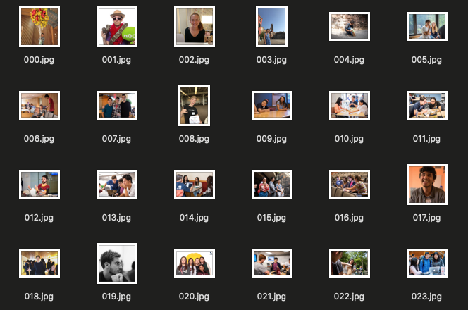
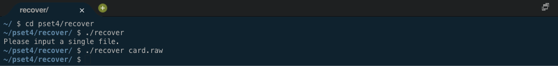

# **Data Recovery Tool**

# Description
A pure C application I built that reads memory locations on a memory card to retrieve deleted JPEG images and writes copies of these images to new JPEG files, based on hexidecimal values and 512 byte blocks.

It's a pretty cool application considering its use of pointers and hexidecimal signatures, not to mention its ability to recover apparently "lost," deleted photos. This [project](https://cs50.harvard.edu/x/2020/psets/4/recover/) was from CS50's section on [computer memory](https://cs50.harvard.edu/x/2020/weeks/4/).

Pictures of the application are below. Click them for larger versions.

#

# Project Files
The following links contain summary overviews of each file used in the project. Please refer to a file's code directly for specific implementation and details regarding that file.

* [card.raw](#card.raw)
* [recover.c](#recover.c)
* [000.jpg](#000.jpg)

## card.raw
This is a [forensic image](https://whatis.techtarget.com/definition/forensic-image) of the memory card provided by the course's instructors. It contains 50 JPEG images that the program should recover.

## recover.c
This file contains all of the application code. It names files, reads and writes information to files, and dynamically allocates and frees memory where necessary.

## 000.jpg
Our JPEGs follow this format. There are 50 of them on the forensic image.

# License & Copyright
© Alex Guidace

Licensed under the [MIT License](License).
